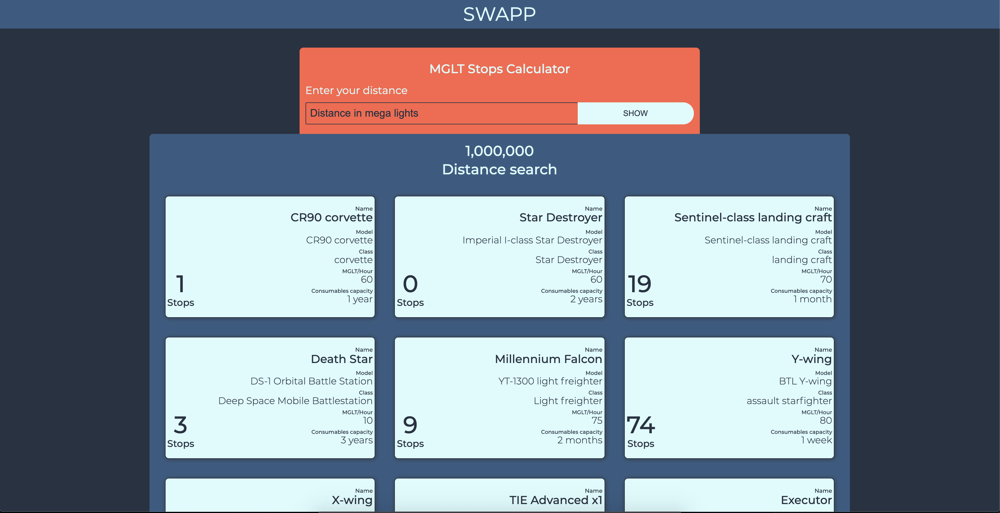
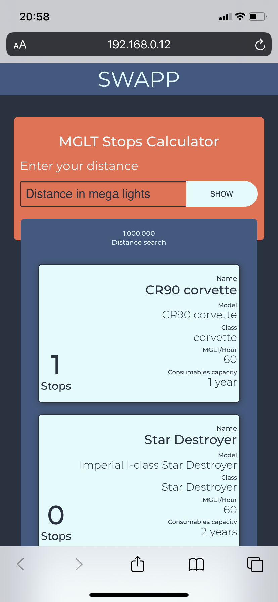

# MGLT Stops Calculator

## Sobre o repositório

Este repositório foi criado como solução para o desafio da Nata House para a vaga de Desenvolvedor Frontend, a descrição completa do desafio pode ser encontrada [aqui](https://www.notion.so/Technical-test-nata-house-b41bd08b949d4cf194a18322b28bf09b).

## Iniciando

A base do desafio é criar uma SPA que conectado a Star Wars Api [SWAPI](https://swapi.dev/) permita que nosso usuário faça o calculo de quantas paradas seriam necessarias para viajar uma determinada distancia, medida em Megaluz(Megalights).

Para o desafio optei por utilizar React e construir uma Single Page Application algumas bibliotecas para chegar ao resultado esperado e entregar uma boa experiência para o usuário.

## Solução

|                  Desktop                   |                  Mobile                  |
| :----------------------------------------: | :--------------------------------------: |
|  |  |

A página ao iniciar busca as naves na base de dados da SWAPI e persiste os dados no LocalStorage (para funcionar posteriormente offline) e assim que o usuário define a distancia calcular é entregue uma lista com as naves, informações básicas e a quantidade de paradas necessárias para realizar o trajeto.

## Cálculo de Megaluz

A Megaluz é uma unidade de distância utilizada no universo de Star Wars como base para medir a velocidade de deslocamento das naves no espaço.
A database da SWAPI contém uma base ampla de naves com a velocidade de deslocamento calculada em MGLT/hora, utilizamos essa informação como base do cálculo.
Outra informação de extrema relevância é o período máximo de tempo que a nave pode fornecer consumíveis para toda a tripulação sem a necessidade de reabastecimento, podendo ser medida em horas, dias, meses e anos.

Para realizar o cálculo primeiro transformamos a capacidade de carga em horas, em seguida dividimos a distância pela velocidade da nave, para no fim dividir a capacidade de carga (em horas), pelo tempo gasto para percorrer a distância (em horas) o resultado arredondado para baixo é a nossa quantidade de paradas.

### Pré requisitos

Para utilizar os projetos é necessário ter o Node instalado na máquina, o projeto foi criado utilizando node na versão 12.16.3 download [aqui](https://nodejs.org/en/).

O projeto utilizou como base de sua criação o create react app.

## Instalação

Para rodar o projeto basta utilizar os comandos abaixo:

```bash
  $ npm install
  # ou caso utilize yarn
  $ yarn install
```

## Rodando a aplicação

```bash
# Android
$ npm start
# ou caso utilize yarn
$ yarn start
```

O projeto utiliza além do react, as seguintes bibliotecas:

- Axios (recuperar os dados da Api)
- Moment (para calcular o periodo de abastecimento das naves)
- React Router Dom (gerenciar a navegação)
- Redux & React Redux (estado global para a aplicação)
- Redux Persist (persistir dados da página no localstorage)
- Styled Components (auxiliar na criação dos componentes, estilos, e temas)
- Styled Icons (opções de ícones para a aplicação)

## Estrutura do projeto

    src/
      -assets/
      -components/
      -pages/
        -Main/
      -redux/
      -routes/
      -services/

### assets

Pasta para a definicação do tema padrão da nossa aplicação, resetar e aplicar os estilos globais no css.

### components

Nesse diretório ficam os componentes que podem ser compartilhados no nosso projeto, componentes 'comuns' para todo o projeto.

### pages

O diretório onde ficam armazenadas as páginas, cada página fica dentro do seu respectivo diretório, a página tem como principal responsabilidade buscar e tratar dados (através do services e redux) para serem repassados para os componentes.

##### Observação

Caso a pagina necessite de estilos própios eles são encontrados no arquivos _styles.js_ que ficam dentro do diretório da página e não devem ser importados por nenhuma outra página, caso isso ocorra ele deve ser deslocado para o diretório \_components- e virar dependência de ambas as páginas.

### redux

A pasta contém a configuração da nossa store, da biblioteca redux-persist.
O projeto utiliza o conceito a estrutura do Redux com o padrão Duck, nesse padrão agregamos as _actions_, _reducers_ e _types_ em um único arquivo, caso queira conhecer mais sobre o padrão sugiro os links:

- [Ducks Modular Redux](https://github.com/erikras/ducks-modular-redux)
- [Scaling your Redux App with ducks](https://www.freecodecamp.org/news/scaling-your-redux-app-with-ducks-6115955638be/)

### routes

Organização das rotas da aplicação utilizando react router dom.

### services

O diretório services armazena os arquivos responsáveis por recuperar e enviar dados para nossas API's.
